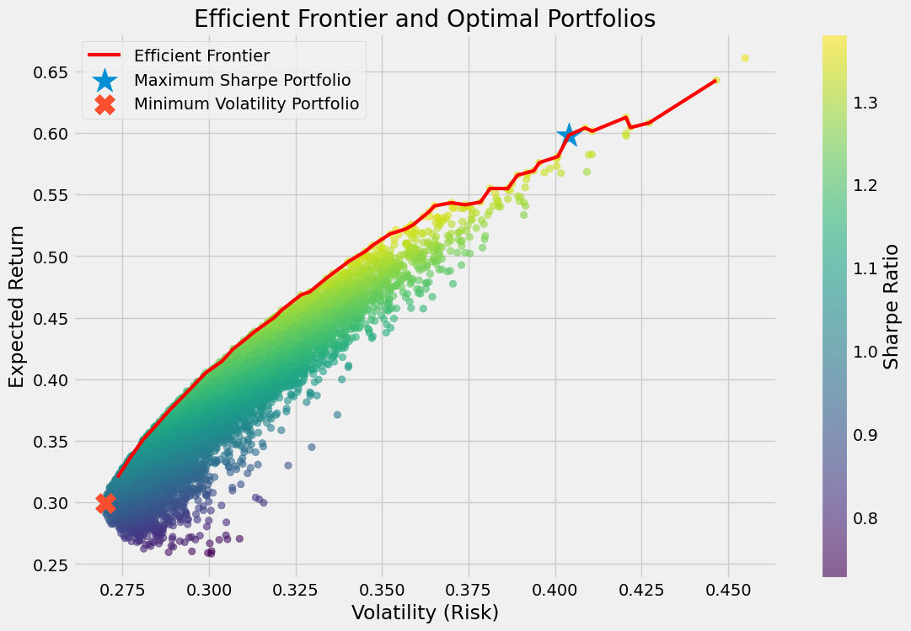
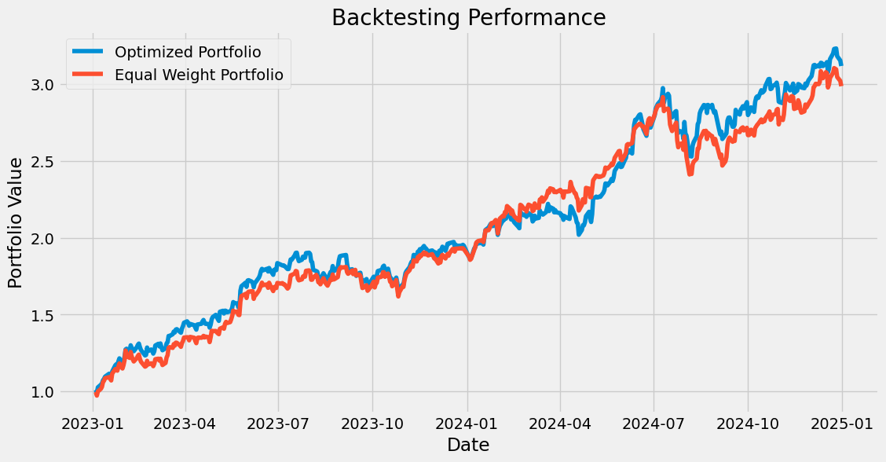
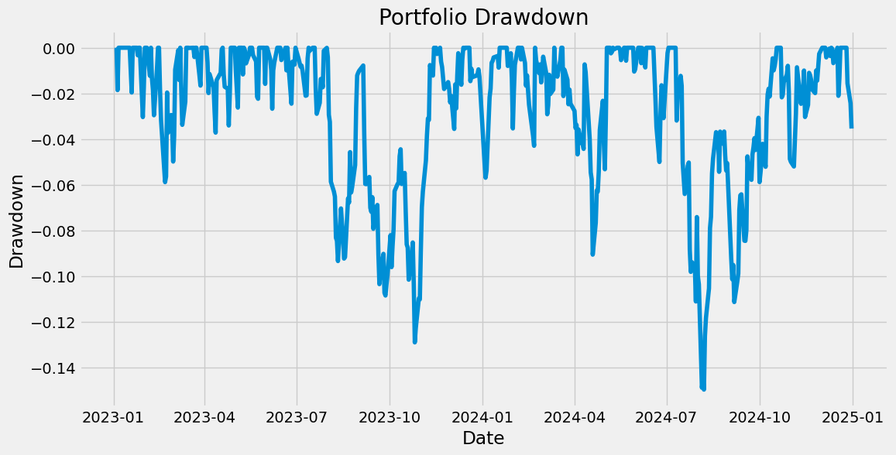

# Portfolio Optimization and Backtesting Framework

<h2>Efficient Frontier</h2>

  

This project implements a portfolio optimization and backtesting framework using **Modern Portfolio Theory (MPT)**, **Monte Carlo Simulation**, and historical stock market data. The objective is to construct portfolios that maximize risk-adjusted returns while demonstrating the benefits of diversification and quantitative portfolio management.

The framework analyzes a portfolio consisting of:

* Apple (AAPL)
* Microsoft (MSFT)
* Nvidia (NVDA)
* Amazon (AMZN)
* Alphabet (GOOGL)

Historical market data is collected using Yahoo Finance and used to estimate expected returns, volatility, and covariance relationships between assets.

---

## Project Objectives

* Analyze historical stock performance and risk characteristics
* Estimate annualized returns and volatility
* Study correlation and covariance relationships between assets
* Generate thousands of random portfolios using Monte Carlo Simulation
* Construct the Efficient Frontier
* Identify the Maximum Sharpe Ratio Portfolio
* Identify the Minimum Volatility Portfolio
* Evaluate portfolio performance using out-of-sample backtesting
* Measure risk-adjusted performance using professional portfolio metrics

---

## Technologies Used

* Python
* NumPy
* Pandas
* Matplotlib
* Seaborn
* yFinance
* Jupyter Notebook

---

## Methodology

### 1. Data Collection

Historical adjusted closing prices were collected using Yahoo Finance for five large-cap technology stocks between 2019 and 2024.

### 2. Return and Risk Analysis

Daily returns were computed and annualized to estimate:

* Expected Annual Returns
* Annualized Volatility
* Correlation Matrix
* Covariance Matrix

### 3. Portfolio Optimization

A Monte Carlo simulation was used to generate more than **10,000 random portfolios**.

For each portfolio:

* Expected Return was calculated
* Portfolio Volatility was estimated using the covariance matrix
* Sharpe Ratio was computed assuming a 4% risk-free rate

The simulation was used to identify:

* Maximum Sharpe Ratio Portfolio
* Minimum Volatility Portfolio

### 4. Efficient Frontier

The Efficient Frontier was constructed to visualize the set of portfolios that provide the highest expected return for a given level of risk.

### 5. Backtesting

The dataset was divided into:

* Training Period: 2019–2022
* Testing Period: 2023–2024

Portfolio weights were optimized using only training data and subsequently evaluated on unseen testing data to avoid look-ahead bias.

### 6. Performance Evaluation

The optimized portfolio was evaluated using:

* Annual Return
* Annual Volatility
* Sharpe Ratio
* Sortino Ratio
* Maximum Drawdown
* Calmar Ratio

---

## Key Results

### Portfolio Optimization

| Metric            | Value  |
| ----------------- | ------ |
| Annual Return     | 59.81% |
| Annual Volatility | 40.39% |
| Sharpe Ratio      | 1.38   |

### Backtesting Performance

| Metric            | Optimized Portfolio |
| ----------------- | ------------------- |
| Annual Return     | 59.97%              |
| Annual Volatility | 23.27%              |
| Sharpe Ratio      | 2.41                |
| Sortino Ratio     | 3.97                |
| Maximum Drawdown  | -14.97%             |
| Calmar Ratio      | 4.01                |

The optimized portfolio outperformed an equal-weight benchmark during the testing period while maintaining strong risk-adjusted performance.

---

## Visualizations

<h2>Efficient Frontier</h2>

  

<h2>Backtesting Performance</h2>

  

<h2>Portfolio Drawdown</h2>

  

---

## Conclusion

This project demonstrates the application of quantitative finance techniques for portfolio construction, optimization, and evaluation. By combining Modern Portfolio Theory, Monte Carlo Simulation, Efficient Frontier analysis, and out-of-sample backtesting, the framework provides a practical approach to building and assessing investment portfolios using historical market data.
